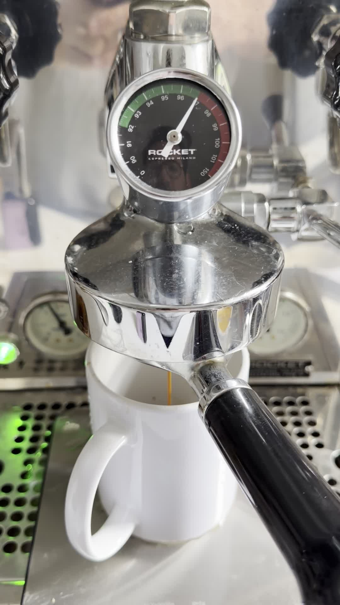
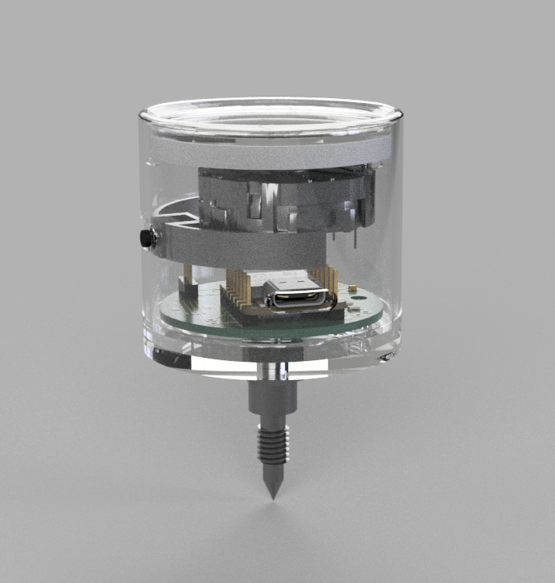
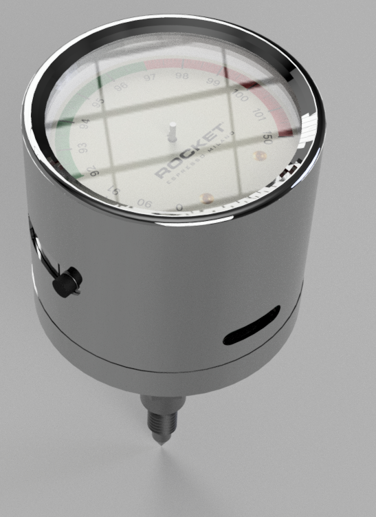
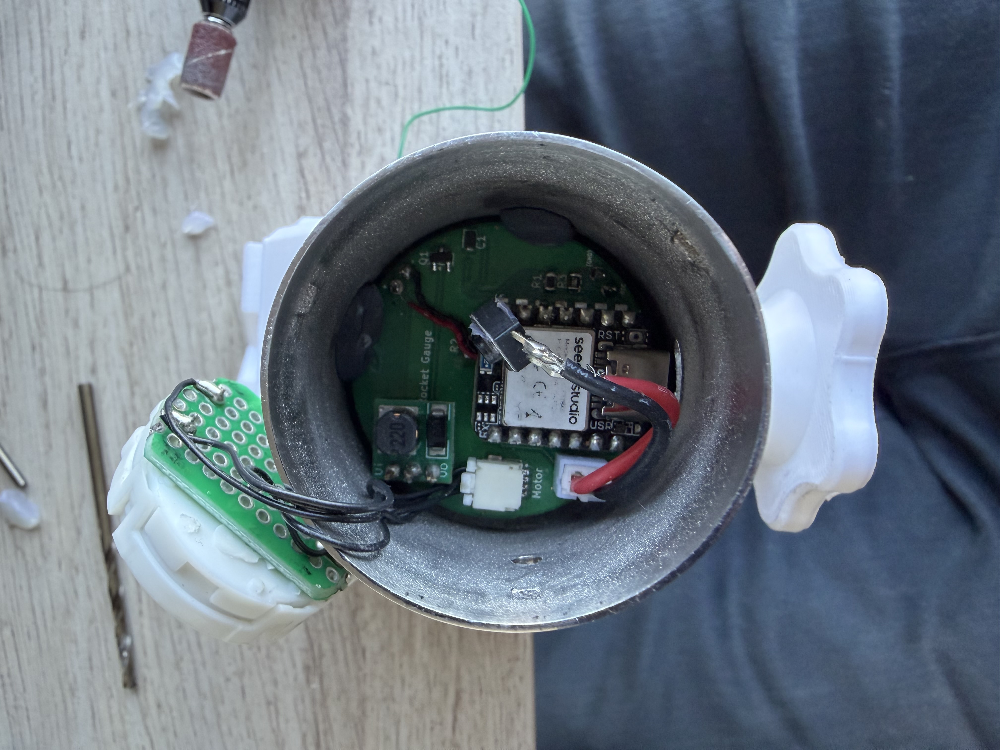

# Rocket Gauge

An analog temperature gauge for E61 espresso machines. A custom PCB drives a VID6606 stepper motor gauge needle, reading temperature from an NTC thermistor. The gauge connects via BLE to a web app for calibration and real-time monitoring.

The dial has a non-linear scale (0–150°C) with an expanded green zone at 92–97°C for precision in the critical temperature range.

<p align="center">
  
</p>

<p align="center">
  
  &nbsp;
  
  &nbsp;
  
</p>

<p align="center">
  <a href="media/demo.mov">▶ Watch demo video</a>
</p>

---

## Hardware

Built around a **Seeed Studio XIAO nRF52840**. Key components:

- VID6606 stepper driver (SOIC-28) driving the gauge needle
- 100kΩ NTC thermistor for temperature sensing
- 2N2222A transistor switching a 5V boost converter
- Momentary button for power management (deep sleep after 10 min idle)
- JST connector for the stepper motor coils

The PCB was custom manufactured and assembled. The dial face is a custom design with a non-linear scale — the green zone (92–97°C) is expanded for precision while the cold and hot extremes are compressed. The SVG is in `hardware/dial_face.svg`. KiCad source files, schematic, and BOM are in `hardware/`.

## Enclosure

The enclosure was SLM (selective laser melting) 3D printed in metal and hand-sanded to achieve the chrome-like finish. Fusion 360 source (`enclosure/gauge_enclosure.f3z`), STEP, and STL files are in `enclosure/`.

### KiCad libraries

The schematic uses two non-standard libraries included in `libraries/`:

- `XIAO_nRF52840.pretty/` — footprint for the XIAO nRF52840 module
- `Seeed_Studio_XIAO_Series/` — schematic symbol

Add both to your KiCad library paths before opening the project.

## Firmware

Arduino sketch in `firmware/gauge/`. Uses the Adafruit nRF52 BSP.

**Dependencies** (install via Arduino Library Manager):
- `Adafruit TinyUSB`
- `Adafruit nRF52` BSP (includes `bluefruit`, `Adafruit_LittleFS`, `InternalFileSystem`)
- `AccelStepper`

The gauge supports BLE serial commands for calibration, homing, sweep tests, and configuration. See `firmware/gauge/commands.h` for the full command set.

## Web App

A Web Bluetooth app in `webapp/` — open `index.html` in Chrome (Android, macOS, or Windows). iOS Safari does not support Web Bluetooth.

Connect to the gauge over BLE to monitor temperature, set calibration points, and control the needle.

## Tools

Python utilities in `tools/` for serial-based development and testing.

```
pip install -r tools/requirements.txt
python tools/serial_terminal.py
```

## vid6606

`vid6606/` contains a standalone sweep demo sketch and a copy of the [SwitecX25](https://github.com/clearwater/SwitecX25) stepper library used for the VID6606 driver.

## test_ntc_sketch

A minimal Arduino sketch for validating NTC thermistor readings independently of the main firmware.
